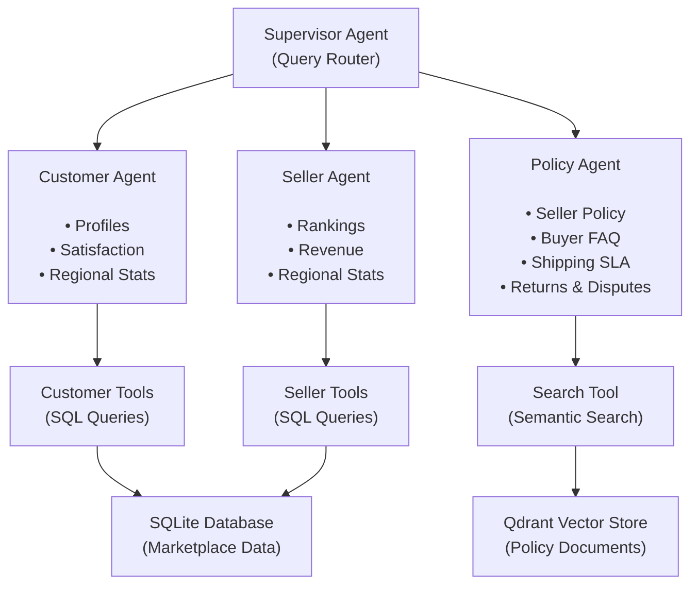
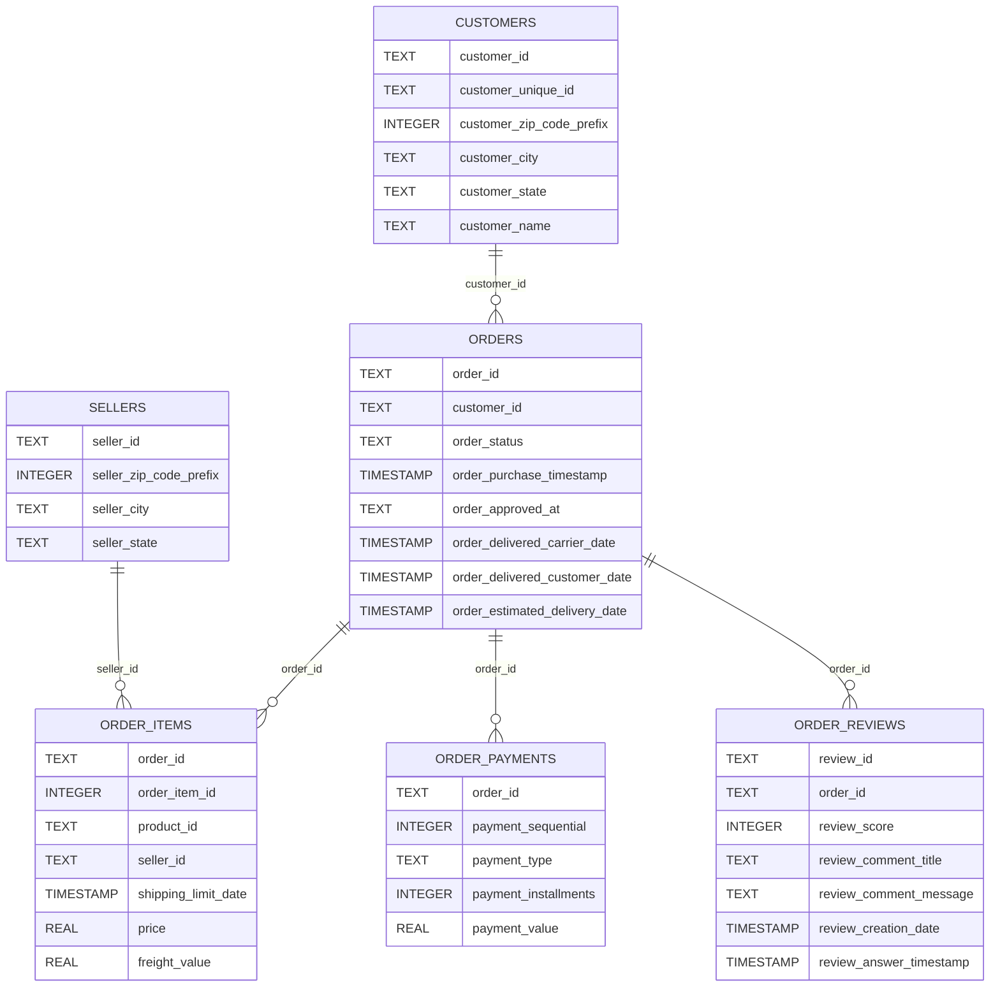

# Agentic Market

A multi-agent conversational AI for querying e-commerce marketplace data using natural
language.


## Features

- **Multi-agent architecture** - Supervisor agent routes queries to specialized
  customer, seller, and policy agents
- **SQL-powered tools** - Agents use SQL tools to query the database and retrieve real
  data
- **RAG pipeline** - Policy agent performs semantic search over marketplace documents
  using Qdrant and Gemini embeddings
- **Natural language queries** - Ask questions in plain English, get structured insights
- **Streaming responses** - Real-time token streaming for responsive UX
- **Prompt injection protection** - Input guardrails using LLM Guard
- **Multi-provider LLM support** - Switch between Google Gemini and Groq
- **Auto-initialization** - Database and vector store automatically created on first run
- **Session persistence** - Conversation memory within sessions

## Architecture



The **Supervisor Agent** analyzes user queries and routes them to the appropriate
specialist:

- **Customer Agent** - Handles customer profiles, satisfaction scores, delivery metrics
- **Seller Agent** - Handles seller rankings, revenue analysis, performance metrics
- **Policy Agent** - Handles marketplace policies, seller requirements, shipping SLAs,
  returns, and dispute resolution via RAG over policy documents

For cross-domain questions, multiple agents are called and results are synthesized.

## Tech Stack

| Component       | Technology                                                                             |
|-----------------|----------------------------------------------------------------------------------------|
| Chat UI         | [Chainlit](https://chainlit.io/)                                                       |
| Agent Framework | [LangChain](https://langchain.com/) + [LangGraph](https://www.langchain.com/langgraph) |
| LLM Providers   | [Google Gemini](https://aistudio.google.com/welcome), [Groq](https://groq.com/)        |
| Embeddings      | [Google Gemini](https://ai.google.dev/gemini-api/docs/embeddings)                      |
| Vector Store    | [Qdrant](https://qdrant.tech/)                                                         |
| Database        | SQLite                                                                                 |
| Input Security  | [LLM Guard](https://protectai.com/llm-guard)                                           |
| Configuration   | Pydantic Settings                                                                      |

## Installation

**Prerequisites:** Python 3.12+, [uv](https://docs.astral.sh/uv/) (recommended) or pip

1. Clone the repository:
   ```bash
   git clone https://github.com/EmreKaratopuk/agentic-market.git
   cd agentic-market
   ```

2. Install dependencies:

   **With uv (recommended):**
   ```bash
   uv sync
   ```

   **With pip:**
   ```bash
   python -m venv .venv
   source .venv/bin/activate  # On Windows: .venv\Scripts\activate
   pip install -r requirements.txt
   ```

3. Set up environment variables:
   ```bash
   cp .env.sample .env
   ```

4. Add your API keys to `.env`:
   ```
   GOOGLE_API_KEY=your_gemini_api_key
   GROQ_API_KEY=your_groq_api_key
   ```

## Configuration

Edit `config.py` and set environment variables:

| Setting             | Default                | Description                       |
|---------------------|------------------------|-----------------------------------|
| `LLM_PROVIDER`      | `gemini`               | LLM provider (`gemini` or `groq`) |
| `LLM_TEMPERATURE`   | `0.1`                  | Model temperature                 |
| `GEMINI_MODEL`      | `gemini-2.5-flash`     | Gemini model name                 |
| `GROQ_MODEL`        | `qwen/qwen3-32b`       | Groq model name                   |
| `DATABASE_PATH`     | `marketplace_data.db`  | SQLite database path              |
| `DATA_DIR`          | `data`                 | Directory containing CSV files    |
| `QDRANT_PATH`       | `qdrant_storage`       | Qdrant local storage directory    |
| `QDRANT_COLLECTION` | `marketplace_docs`     | Qdrant collection name            |
| `DOCS_DIR`          | `docs`                 | Directory containing policy docs  |
| `EMBEDDING_MODEL`   | `gemini-embedding-001` | Google embedding model            |

### Optional: LangSmith Tracing

For observability and debugging,
enable [LangSmith](https://www.langchain.com/langsmith/observability)
tracing:

```
LANGCHAIN_TRACING_V2=true
LANGCHAIN_API_KEY=your_langsmith_api_key
LANGCHAIN_ENDPOINT=https://api.smith.langchain.com
LANGSMITH_PROJECT=agentic-market
```

## Usage

Start the application:

```bash
chainlit run app.py
```

Or:

```bash
python app.py
```

Open http://localhost:8000 in your browser.

> **Note:** The first run may take a few minutes as it downloads and sets up ONNX models
> for the input guardrails, creates the SQLite database from CSV files, and indexes
> policy documents into the vector store.

### Example Queries

| Query                                                                             | Routed To                     |
|-----------------------------------------------------------------------------------|-------------------------------|
| "Who are the top 5 sellers by revenue?"                                           | Seller Agent                  |
| "How many customers are in São Paulo?"                                            | Customer Agent                |
| "Show me customer statistics for all states"                                      | Customer Agent                |
| "Compare seller performance across regions"                                       | Seller Agent                  |
| "Which state has the highest average order value?"                                | Customer Agent                |
| "What are the requirements to start selling?"                                     | Policy Agent                  |
| "How do I return a product?"                                                      | Policy Agent                  |
| "How long does dispute resolution take?"                                          | Policy Agent                  |
| "What is the marketplace health overview?"                                        | Customer Agent + Seller Agent |
| "Which states have the lowest satisfaction scores and what is the refund policy?" | Customer Agent + Policy Agent |

## Project Structure

```
├── .env.sample            # Environment variables template
├── pyproject.toml         # Project dependencies and metadata (for uv)
├── requirements.txt       # Dependencies for pip users
├── app.py                 # Chainlit entry point, message handlers
├── config.py              # Settings (LLM provider, models, paths)
├── data/                  # Olist CSV datasets
├── docs/                  # Marketplace policy documents (RAG source)
├── src/
│   ├── agents/            # Agent definitions
│   │   ├── supervisor_agent.py   # Routes queries to sub-agents
│   │   ├── customer_agent.py     # Customer data specialist
│   │   ├── seller_agent.py       # Seller data specialist
│   │   └── policy_agent.py       # Policy & FAQ specialist
│   ├── tools/             # Agent tools
│   │   ├── customer.py    # Customer profile & stats queries
│   │   ├── seller.py      # Seller ranking & stats queries
│   │   └── search.py      # Semantic search over policy docs
│   ├── prompts/           # Modular prompt templates
│   │   ├── supervisor/    # Supervisor agent prompts
│   │   ├── customer/      # Customer agent prompts
│   │   ├── seller/        # Seller agent prompts
│   │   ├── policy/        # Policy agent prompts
│   │   └── shared/        # Reusable prompt components
│   ├── database.py        # SQLite wrapper, CSV auto-import
│   ├── vectorstore.py     # Qdrant wrapper
│   ├── guardrails.py      # Prompt injection scanner
│   ├── llm.py             # LLM provider initialization
│   └── schemas.py         # Pydantic response models
```

## Database Schema

The application uses
the [Olist Brazilian E-commerce dataset](https://www.kaggle.com/datasets/olistbr/brazilian-ecommerce)
containing ~100k orders from 2016-2018.
SQL queries follow
the [GitLab SQL Style Guide](https://handbook.gitlab.com/handbook/enterprise-data/platform/sql-style-guide/).


